# Discrete models
<div class="flex-container">
  <div class="left-div callback">
    <h3>💡 Previously on...</h3>  
    <p>We covered philosophy of (scientific) modeling and LHD's recipe for modeling. We distinguished between scale, analogical, idealized, and phenomenological models. Can you remember what is the difference between aristotelian and galilean idealized models? Why phenomenological models not understood as mecanistic models?</p>
    <br>
    <p>We then introduced compartment models by drawing diagrams. How do we distinguish the boxes from one another? What are the assumptions that go into building a models as boxes? What are we missing?</p>
  </div>
  <div class="right-div reading-box">
    <h3>📚 Week 3 readings</h3>
    <ul class="reading-list">
    <li><span>📖</span> <a href="https://math.libretexts.org/Bookshelves/Scientific_Computing_Simulations_and_Modeling/Introduction_to_the_Modeling_and_Analysis_of_Complex_Systems_(Sayama)/03%3A_Basics_of_Dynamical_Systems" target="_blank">Basics of Dynamical Systems (Ch. 3 Sayama)</a><sup>*</sup></li>
    <li><span>📖</span> <a href="https://math.libretexts.org/Bookshelves/Scientific_Computing_Simulations_and_Modeling/Introduction_to_the_Modeling_and_Analysis_of_Complex_Systems_(Sayama)/04%3A_DiscreteTime_Models_I__Modeling" target="_blank">Discrete-Time Models I - Modeling  (Ch. 4 Sayama)</a><sup>*</sup></li>
    <li><span>📖</span> <a href="https://scholarship.claremont.edu/cgi/viewcontent.cgi?article=2153&context=hmc_fac_pub" target="_blank">Mathematics for Human Flourishing (Francis Su)</a><sup>*</sup></li>
    </ul>
  </div>
</div>

This week, we convert last week's boxes into discrete dynamical equations that we can do maths and compute. We start with the SIR model, and show how we can make it more heterogenous by introducing, for instance, different degrees of susceptibility, distinct removal status (e.g., long lasting sickness, dead, recovered), or infection awareness (e.g., asymptomatic).

<iframe src="https://streaming.uvm.edu/embed/49961/" width="560" height="315" frameborder="0" allowfullscreen></iframe>

In this video, LHD walkthroughs the SIS model and introduces the mean-field approximation:

<iframe src="https://streaming.uvm.edu/embed/49962/" width="560" height="315" frameborder="0" allowfullscreen></iframe>

We are now ready to convert the mathematics into code: 

<iframe src="https://streaming.uvm.edu/embed/49963/" width="560" height="315" frameborder="0" allowfullscreen></iframe>

As an example, LHD imagines a cloning factory as idealized through the diagram below: 

${mermaid`graph LR
      cIN --a (N->N+1)---> CloneFactory;
      CloneFactory --c (N->2N)---> CloneFactory;
      CloneFactory --l (N->N-1)---> cOUT;
      style cIN fill:#fff,stroke:#fff,color:#fff
      style cOUT fill:#fff,stroke:#fff,color:#fff
`}

where ${tex`c`} is the rate at which people clone themselves, and ${tex`a`} and ${tex`l`} are the rates at which people arrive and leave the factory, respectively. Events within each of these three processes occur at a fixed rate, hence independently from each other. These are Poisson processes, perhaps the simplest type of random process.

<div class="def">
<h3>Poisson Processes</h3>
  Something happens at a given (fixed) rate, regardless of what happens beforehand.
</div>


Back to example above, every now and then (e.g., everyday if we assume ${tex`Δt = 1\textrm{day}`}) the factory (weirdly enough) thus ask you to follow this procedure:

```julia
# Julia code
for t=1:Δt:T
  if rand() < a*Δt
    N_t += 1         # 'arrivals' (people getting into the building)
  end
  for n=1:N_t 
    if rand() < l*Δt
      N_t -= 1     # 'departures'  (people leaving it)
    else
      if rand() < c*Δt
        N_t += 1       # 'cloning' (people cloning themselves)
      end
    end
  end
end
```

A couple of observations here. What if a transition rate, say ${tex`a`}, is too high so to make the associated transition probability ${tex`a\cdot Δt`} larger than 1? This occurs because the duration ${tex`Δt`} of the time step you are considering is too large. For instance, if there are, on average, three people entering the building in a day and ${tex`Δt`} stands for _one day_, then ${tex`a\cdot Δt = 3/\textrm{day} \cdot \textrm{day} = 3 > 1`}. To solve the problem, take for example ${tex`Δt = 1\textrm{hour}`}, so that now ${tex`a = (3/24)/\textrm{day}`} and ${tex`a\cdot Δt = (3/24)/\textrm{hour} \cdot \textrm{hour} = 1/8 < 1`}.

Also, order matters. We are testing departure first, assuming that people can replicate only if they have not decided to leave the building. One could think of alternative situations where, during the same time step (which, remember, being finite allows for multiple processes to take place within it), people first try to clone themselves and then consider to leave; or, where recently arrived people are not allow to replicate or leave immediately after arrival (which would mean moving the `arrivals' code block to the end). In all cases, two events involving the same individual can never be simultaneous (in the factory, e.g., you can't leave while arriving or cloning yourself while leaving). Time discreteness forces us to hardwire the order of the potential events.

In the clip below, LHD shows how both these issues – transition probabilities larger than one and time ordering of competing events – are solved by considering small enough (eventually infinitesimal) time steps. 

<iframe src="https://streaming.uvm.edu/embed/49964/" width="560" height="315" frameborder="0" allowfullscreen></iframe>

...

### Key properties of Poisson processes

__P1__: The rate ${tex`{\Lambda}`} of a sum of ${tex`n`} Poisson processes of rates ${tex`{\lambda_1}`}, ${tex`{\dots}`}, ${tex`{\lambda_n}`}, is the sum of the rates,
```tex
\Lambda = \sum_{k=1}^n \lambda_k
```

__P2__: Given ${tex`n`} competing Poisson processes, the probability of Poisson process of rate ${tex`\lambda_i`} occuring first is
```tex
\frac{\lambda_i}{\sum_{k=1}^n \lambda_k} = \frac{\lambda_i}{\Lambda}
```

<div class="callout-box">
  <h3>Things to do by Thursday at noon</h3>
  <ul class="checklist">
    <li><input type="checkbox" id="task1"><label for="task1">Quiz 3</label></li>
  </ul>
</div>

---

## Case study: discrete SIR

<!-- <div class="math-box">
Work in progress, there might be mistakes.
</div> -->

We review this week's key concepts by analyzing the discrete-time SIR model. For each contact between a susceptible and an infected individual, an infection event occurs with probability ${tex`\beta \Delta t`}. Susceptible individuals then recover (more generally, the ${tex`R`} compartment can stand for 'removed', for individuals there are effectively outside the dynamics, either because they gain definitive immunity or die) with probability ${tex`\gamma \Delta t`}. We can resume these assumptions using a flow diagram:

```mermaid
graph LR
S("S") --(βΔt)SI---> I("I")
I("I") --(αΔt)I---> R("R")
```



We already saw in the second clip how to derive the probability that a susceptible individual gets the infection via at least one infectious contact. It reads ${tex`1 - ( 1 - \beta \Delta t)^{I(t)}`}, namely, ${tex`1\ -`} [probability of _not_ getting infected by any of the ${tex`I(t)`} contacts]. (Say 4\% transmission probability and 5 infected contacts, you get ${(Math.pow(1-0.04, 5)*100).toFixed(1)}\% of chance of not being infected.)

<!-- There are different ways to translate this sketch into mathematics and code. If we focus on the change in infected individuals, we could write


```tex
I(t+1) = \beta S(t)I(t) - \alpha I(t)
```

In the discrete realm, this version has two issues. First, what if we assume a relatively high ${tex`\beta`}? What is a relatively high parameter anyway? Say that, naively, we assume that each infected individiual is infecting 5\% of its contact. That each individual stays infectious on average 3 days (${tex`\alpha=0.33`}). And that the population starts with 1 infected individuals, in a population of 10,000. We get the following:

```js
Inputs.table(naive_approach(), {header: ["suceptible", "infected"], maxWidth: 400})
```

This is nonsense. What is happening? The issue is that in a [fully-connected]() world, infecting 5\% of 10,000 leads to a lot of transmission. Using the number of transmission by contact rate you can end up with more transmission than there are susceptible individuals. But you can't get infected more than once! One way around this problem is to have a very small transmission probability, say 5 in a million (or ${5/1_000_000}). This approach is hinting at the second issue; that of simultaneous events. By assuming a very small ${tex`\beta`}, we are assuming that there is very little chance than two infection event happen at the same time.  -->

<!-- What we can do instead is to change the units of our model, going from counting contacts to counting people switching from susceptible to infected. How? In plain english, we want the probability of _not having a transmission_. In this week's second clip, we saw that ${tex`(1-\beta)^{I(t)}`} is the probability of susceptible people of not being infected (aka, say 5\% transmission probability, with 4 infected individuals, you get (${(Math.pow(1-0.05, 5)*100).toFixed(2)}\% of chance of not being infected). Then, ${tex`1 - \text{(prob not infected)}`} is the probability of not having a transmission event, which is normalized between 0 and 1. -->

We thus get the following system of three equations

```tex
\begin{align}
    S(t+\Delta t) &= S(t) ( 1 - \beta \Delta t)^{I(t)} \tag{1a}\\
    I(t+\Delta t) &= (1 - \gamma \Delta t)I(t) + S(t) \left[1 - ( 1 - \beta \Delta t)^{I(t)}\right] \tag{1b}\\
    R(t+\Delta t) &= R(t) + \gamma \Delta t I(t) \tag{1c}
\end{align}
```

In code (taking ${tex`\Delta t = 1`}):

```js echo
function runMAthDiscreteSIR(steps, N, β, γ) {
    // Initialize
    let I = 1, R = 0
    let S = N - I - R;
    
    // Pre-allocated arrays (faster)
    let St = new Array(steps);
    let It = new Array(steps);
    let Rt = new Array(steps);
    
    // Observe
    for (let step = 0; step < steps; step++) {
      St[step] = S;
      It[step] = I;
      Rt[step] = R;

      // Update
      let delta_I = S*(1 - Math.pow(1 - β, I))
      let delta_R = γ*I  

      S -= delta_I;
      I += delta_I - delta_R;
      R += delta_R;

    }
    return [St, It, Rt];
}
```

```js
// let toggle = view(Inputs.toggle({label: "use ( 1 - (1-β)^I(t) )"}))
let beta = view(Inputs.range([0.00001, 0.0005], {label: "β", step: 0.00001, value:  0.00005}))
let gamma = view(Inputs.range([0.0, 1.], {label: "γ", step: 0.01, value:  0.1}))
```

```js
let [S, I, R] = runMAthDiscreteSIR(100, 10000, beta, gamma);
```
```js
Plot.plot({
  x: {label: "time"},
  y: {label: "# people", grid:true},
  color: {
    type: "categorical", 
    domain: ["susceptible", "infected", "recovered"], 
    range: ["green", "red", "blue"], 
    legend:true
  },
  marks: [
    Plot.frame(),
    Plot.lineY(S, {stroke: "green"}),
    Plot.lineY(I, {stroke: "red"}),
    Plot.lineY(R, {stroke: "blue"}),
    ]
  })
```

<!-- The rates of changes are still going fast, but at least we don't get nonsensical values. -->

...

The model above is deterministic as it only tracks the expected values of the number of individuals in each compartment. Such formulation is exact _only_ for a system of infinite size, as fluctuation around the mean becomes negligible. The stochasticity of the contagion process thus never disappears for a system of finite size (aka, real-world systems). We can see this by simulating the process using random variables. In this case, we rely on the Binomial distribution, which helps us determine how many successful events occur – such as how many susceptible individuals become infected – based on the probability of infection derived from the expected rate. The code remains largely the same, but we adjust how we update key quantities.

```echo
function runCompDiscreteSIR(steps, N, β, γ) {
    
    [...]
    
    for (let step = 0; step < steps; step++) {
    
      [...]
      
      // We use our previously defined math as probability of infection in the Binomial distribution
      let p_inf = 1 - Math.pow(1 - β, I); 
      let new_I = Binomial(S, p_inf); 
      let new_R = Binomial(I, γ);
      
      // Update
      S -= new_I;
      I += new_I - new_R;
      R += new_R;

      [...]
}
```

Click the button below to run a simulation and compare with the prediction made by the mathematical model: 

```js
const replay = view(Inputs.button("run new simulation"));
```

```js
replay;
let [Sc, Ic, Rc] = runCompDiscreteSIR(100, 10000, beta, gamma);
```

```js
Plot.plot({
  x: {label: "time"},
  y: {label: "number of infected", grid:true},
  color: {
    type: "categorical", domain: ["infected"],  range: ["red"],  legend:true
  },
  nice:true,
  marks: [
    Plot.frame(),
    Plot.dot(Ic.map((i,t) => [t, i]), {fill: "red", stroke: "white", symbol: "square"}),
    Plot.lineY(I, {stroke: "red"}),
    ]
  })
```

Because of stochasticity, there are variation in draws. Notice, in particular, how from time to time the stochastic process goes extinct before an exponential growth can take place. With only the derministic model in our hand, when should we expect the process to be likely to take off? Imposing ${tex`S(t+\Delta t) = S(t)`} in Equation (1a) or ${tex`R(t+\Delta t) = R(t)`} in Equation (1c) requires ${tex`I = 0`}. Any state configuration ${tex`(S,I,R) = (S,0,N-S)`} is thus a fixed point of the dynamics. This is not really informative. The revelant question is instead whether or not the system experiences a rise in infections before relaxing to an inactive equilibrium. To get an answer, we need to estimate the stability of those fixed points.

<!-- In the discrete SIR model, several fixed points can be identified. First, when $R = N$, no further infections can occur. Similarly, when ${tex`I = 0`}, the epidemic ends. However, a more interesting case is whether fixed points are stable? What if we have no infected individual in the system, then we nudge the system by injecting an infected individual. If the transmission rate is too low, stochastic extinctions occur, meaning patient zero cannot infect enough individuals to sustain the outbreak. At a certain threshold, denoted as ${tex`\beta_c`}, the transmission rate becomes high enough that patient zero will almost certainly trigger an epidemic. -->

### Linear stability analysis and criticality

This is the art of nudging a little our system around a fixed point to determine the (local) stability of that point. If following the perturbation the system tends to go back to that point, then the latter is said to be _stable_. It is _unstable_ if the systems tends to move away from it, or _neutrally stable_ if the perturbation neither grows or shrinks.

For our case study, we want to know the conditions under which the generic fixed point ${tex`(S,I,R) = (S,0,N-S)`} is stable or not. Nudging the system then means introducing an infinitesimal amount ${tex`I \rightarrow 0`} in the infected compartment and see whether such amount will grow to larger values or shrink towards zero. To do this, we first compute Equation (1b) in the ${tex`I \rightarrow 0`} limit. From ${tex`(1-\beta \Delta t)^{I(t)} = 1 - \beta \Delta t I(t) + {\cal O}(I(t)^2)`}, we get
```tex
\begin{align}
    I(t+\Delta t) &= (1 - \gamma \Delta t)I(t) + \beta \Delta t S(t) I(t) \notag \\
    &= (1 - \gamma \Delta t + \beta \Delta t S(t)) I(t) \notag
\end{align}
```
It follows that ${tex`I(t+\Delta t) < I(t)`} – the perturbation shrinks – if and only if ${tex`\beta S < \gamma`}. The infection-free state ${tex`(S,I,R) = (S,0,N-S)`} is stable in this case. Otherwise, if ${tex`\beta S > \gamma`}, the perturbation expands and an outbreak takes place. We can restate these conditions in a more meaningful way by defining the basic reproduction number ${tex`R_0 \equiv \beta S/\gamma`}. Given that ${tex`1/\gamma`} is the average infection period, and that ${tex`\beta S`} is the average rate at which an infected individual produces new infections, ${tex`R_0`} represents the average number of new infections (secondary cases) produced by an infected individual (zero/primary case) in an otherwise infection-free population. The infection-free state is thus stable for ${tex`R_0 < 1`} and unstable for ${tex`R_0 > 1`}. The condition ${tex`R_0 = 1`} marks a _critical point_: outbreaks are expected above it but not below it. This is shown in the plot below, which reports results from the simulated SIR process.

<!-- ### Stability analysis

Stability analysis is the art of nudging a little our system around a given point to determine the (local) stability of fixed points. What do we mean by nudging? Let

```tex
\Delta I \gt 0
```
That’s the nudge. Technically, a nudge is a pertubation of a fixed point, of a inifinitely small change. Now, what we’re really interested in is whether this nudge leads to more infections. We can describe this as:

```tex
\Delta I = \beta SI - \alpha I > 0
```

A little algebra gives us:

```tex
\beta S - \alpha \gt 0 \Rightarrow \beta \gt \frac{\alpha}{S}
```

Now, if we're thinking about patient zero, where almost everyone is still susceptible, we can assume ${tex`S \approx N`}. This gives us the critical transmission rate:

```tex
\beta_c \gt \frac{\alpha}{N}
```

So, for the outbreak to take off, the transmission rate has to be greater than this threshold. -->

```js
manySIRs()
```

We considered a population of size ${tex`N = 10^4`} in a quasi-susceptible initial state (${tex`S \simeq N`}), and took ${tex`\gamma = 0.05`}. Imposing ${tex`R_0 = 1`} yields ${tex`\beta = 5\cdot 10^{-6}`} as the critical value for the infection rate. This is the value where a _phase transition_ occurs, separating the inactive phase (left) from the active one (right).

We can get a more detailed view of this transition if we look at the distribution of outbreak sizes. That is, we choose a value for ${tex`\beta`} (notice the slider below) and run lots of simulations to record how many outbreaks of each possible size occurred. As we cross the critical point ${tex`\beta = 5\cdot 10^{-6}`}, a bulk of large outbreaks appears on the right. These are indeed the large outbreaks we expect to see above the critical point. The adjective _large_ here has a specific meaning: it indicates outbreaks whose size is proportional to the size of the system – double the system's size and those large outbreaks will double their size too. The small outbreaks stored in the left chunk of the distribution, instead, do not scale and so their size becomes negligible as you consider bigger and bigger populations. Because of stochastic fluctuations, such small, localized infection chains are there even far above the critical point, although they become less and less frequent.

```js
const beta2 = view(Inputs.range([2.0e-6, 9.0e-6], {step: 1.0e-6, value: 5.0e-6, label:"β"}))
```
 
```js
loglog_outbreaks()
```

You may have noticed that the plot above has both its axis in logarithmic scale. The reason is that it allows to get a first, visual check of whether the system is or not at a critical point. How? Setting ${tex`\beta = 5\cdot 10^{-6}`} you should be able to see (either making an effort of imagination or running many more simulations to remove some noise) that the tail of the distribution is fitted by a straight line. A straight line in a log-log plot is a power-law in a linear plot, i.e., a curve of the form ${tex`y(x) \propto x^{\alpha}`}. At the critical point, the tail of the cluster size distribution thus follows a power-law. This is a general signature of _criticality_ that you may encounter in any kind of system undergoing a phase transition. Also observe that moving just a little away from the critical point, either below or above it, makes the tail of the (small outbreaks) distribution decaying exponentially.

<!-- Another way to look at this phase transition is by looking at the log-log of number of outbreaks with respect to outbreak size. By varying ${tex`\beta`} around the critical threshold, we can see intensity and frequency of outbreak size change drastically. This is characteristic of heavy tail distributions, that is, distributions that decay slower than any exponential. That is, most of the times you get small values, but once in a life time you get a black swan events that screw everything up. 

When ${tex`\beta`} is small, there's a higher chance of stochastic extinctions. For example, with ${tex`\beta=2e-6`} , the outbreak sizes range from around 100 people to at most a few hundreds. But once you increase ${tex`\beta`} to ${tex`3e-6`}, you start to see large outbreaks become more often (the chunk on the right becomes higher and higher). When crosses the critical threshold, which is roughly , that’s when the contagion really takes off. -->

---

## Bonus content

Lhd introducing Taylor Series and L'Hospital rule

<iframe src="https://streaming.uvm.edu/embed/49965/" width="560" height="315" frameborder="0" allowfullscreen></iframe>

Obligatory reference to 3b1b on L'Hôpital's rule

<iframe width="560" height="315" src="https://www.youtube.com/embed/kfF40MiS7zA?si=DiOypuLPByUvv07D" title="YouTube video player" frameborder="0" allow="accelerometer; autoplay; clipboard-write; encrypted-media; gyroscope; picture-in-picture; web-share" referrerpolicy="strict-origin-when-cross-origin" allowfullscreen></iframe>

And Taylor Series

<iframe width="560" height="315" src="https://www.youtube.com/embed/3d6DsjIBzJ4?si=JmVHNmaA07YDjOxb" title="YouTube video player" frameborder="0" allow="accelerometer; autoplay; clipboard-write; encrypted-media; gyroscope; picture-in-picture; web-share" referrerpolicy="strict-origin-when-cross-origin" allowfullscreen></iframe>


```js
function runCompDiscreteSIR(steps, N, β, γ) {
    // Initialize
    let I = 1;
    let R = 0;
    let S = N - I - R;
    
    // Pre-allocated arrays (faster)
    let St = new Array(steps);
    let It = new Array(steps);
    let Rt = new Array(steps);
    
    // Observe
    for (let step = 0; step < steps; step++) {
      St[step] = S;
      It[step] = I;
      Rt[step] = R;

      let p_inf = 1 - Math.pow(1 - β, I); // 1 - (1-β)^I(t)
      let new_I = Binomial(S,p_inf);
      let new_R = Binomial(I,γ);

      // Update
      S -= new_I;
      I += new_I - new_R;
      R += new_R;

      // If the infected population reaches 0, truncate arrays
      if (I === 0) {
        St = St.slice(0, step + 1);
        It = It.slice(0, step + 1);
        Rt = Rt.slice(0, step + 1);
        break;
      }
    }

    return [St, It, Rt];
}

function naive_approach() {
  let steps = 9;
  let beta = 0.05, alpha = 0.33
  let I = 1, S = 9999

  let St = new Array(steps);
  let It = new Array(steps);

  let res = [[S,I]]
  for (let step = 0; step < steps; step++) {

  // Observe
    St[step] = S;
    It[step] = I;

    // Update
    S -= beta*I*S
    I += beta*I*S - alpha*I
    res.push([S,I])
  }

  return res
}

function Binomial(n,p) {
  return Array.from({length: 1}, d3.randomBinomial(n,p))[0];
}

function manySIRs() {
  const steps = 1000;
  const repetitions = 100;

  const N = 10_000; // Assuming N is defined
  const α = 5/100;

  // Array of β values from 0 to 0.5/N
  const β_values = Array.from({ 
    length: Math.floor(0.5 / N / (0.005 / N)) + 1 }, 
    (_, i) => i * (0.005 / N)
  );

  const outbreak_sizes = [];
  for (const β of β_values) {
      let results = [];
      for (let i = 0; i < repetitions; i++) {
          const [St, It, Rt] = runCompDiscreteSIR(steps, N, β, α);
          results.push(Rt[Rt.length - 1]); // Taking the last value of Rt array
      }
      const averageOutbreakSize = d3.mean(results);
      outbreak_sizes.push(averageOutbreakSize);
  }

  let data = β_values.map((β, i) => ({ β, outbreak_size: outbreak_sizes[i] }))

  return Plot.plot({
    nice:true,
    marginLeft: 50,
    marginRight: 30,
    y: {
      label: "Outbreak size",
      grid:true
      },
    x: {
        label: "Transmission probability (β)"
    },
    marks: [
      Plot.frame(),
      Plot.dot(data, {
          x: "β",
          y: "outbreak_size",
          fill: "black", stroke: "white"
      }),
      Plot.lineY(data, {
          x: "β",
          y: "outbreak_size"
      }),
      Plot.ruleX([α / N], {
          stroke: "blue",
          strokeDasharray: "4,4",
          label: "Critical point"
      })
    ]
});
}

function runReps(steps, N, β, α, repetitions) {
  let results = new Array(repetitions).fill(0);

  // Run the model, many times
  for (let reps = 0; reps < repetitions; reps++) {
    let [S, I, R] = runCompDiscreteSIR(steps, N, β, α);
    results[reps] = R[R.length - 1];
  }

  // Count occurrences of each result (similar to countmap)
  let counts = results.reduce((acc, val) => {
    acc[val] = (acc[val] || 0) + 1;
    return acc;
  }, {});

  // Sorting the keys and filtering out zeros/negative values
  let sortedKeys = Object.keys(counts)
    .map(Number)
    .sort((a, b) => a - b);

  // Filter out zero or negative values and create pairs
  let pairs = sortedKeys
    .filter(k => k > 0)
    .map(k => [k, counts[k]]);

  return pairs;
}
 
function loglog_outbreaks() {
  let N = 10_000
	let steps = 1000
	let repetitions = 10_000
 
 let pairs = runReps(steps, N, beta2, 0.05, repetitions)

 return Plot.plot({
    x: {label: "Outbreak size", type: "log"},
    y: {label: "Counts", type: "log"},
    grid: true,
    marks: [
      Plot.dot(pairs, { fill: "black", stroke: "white"}),
      Plot.line(pairs)
  ],
})

}
```