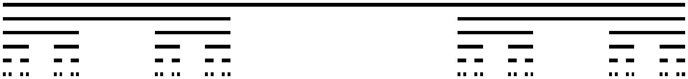

# Cellular Automata and Fractals

  

    <h3>💡 Previously on...</h3>  
    Last week we closed Module 1: Dynamics. Until now, we cared about the functional forms of the interactions in our model, studying the different behaviors they can lead to. At the same time, we assumed that any part of the system can interact with any other part. That is, there is no space in our model or, if you want, there is but it is a trivial one - everything is connected/close to everything. But real systems are embedded in space, and in many cases we cannot neglect this.
     
    

  

  

    <h3>📚 Week 6 readings</h3>
    <ul class="reading-list">
      <li>📖 <a href="https://math.libretexts.org/Bookshelves/Scientific_Computing_Simulations_and_Modeling/Introduction_to_the_Modeling_and_Analysis_of_Complex_Systems_(Sayama)/11%3A_Cellular_Automata_I__Modeling" target="_blank">Cellular Automata I - Modeling (Ch. 11 Sayama)</a>*</li>
      <li>📖 <a href="https://brightspace.uvm.edu/content/enforced/84713-202409-92381/csfiles/home_dir/courses/202209-0824C-Merged/Wolfram_CellularAutomata_1984.pdf" target="_blank">Cellular automata as models of complexity (Wolfram 1984)</a>*</li>
      <li>📖 <a href="https://brightspace.uvm.edu/content/enforced/84713-202409-92381/csfiles/home_dir/courses/202209-0824C-Merged/Mandelbrot_1967.pdf?ou=84713" target="_blank">How Long Is the Coast of Britain? (Mandelbrot 1967)</a>*</li> + <a href="https://brightspace.uvm.edu/content/enforced/84713-202409-92381/csfiles/home_dir/courses/202209-0824C-Merged/Mandelbrot_1967_Appendix.pdf?ou=84713" target="_blank">Appendix</a>*</li>
    </ul>
  

This week we move to Module 2 and learn to incorporate structured interaction into our models of complex systems. Using a concise formulation of local spatial interactions called Cellular Automata (CA), operating in discrete time and space, we will be able to reproduce the same interesting behaviors observed in dynamical systems: phase transitions, attractors, and chaos. Incorporating structure allows a more effective representation of many systems of interest, including the production of beautiful patterns that you can find in nature!

We start with LHD introducing elementary CA, the simplest instance of this kind of system.

<iframe src="https://streaming.uvm.edu/embed/49973/" width="560" height="315" frameborder="0" allowfullscreen></iframe>

Setting all the rules for a CA to work is pretty boring. The fun part of CA is simulating them and enjoying the unexpected! We learn how to implement them in the next video.

<iframe src="https://streaming.uvm.edu/embed/49974/" width="560" height="315" frameborder="0" allowfullscreen></iframe>

Structures as those generated over time by, for instance, _rule 30_ or _rule 110_ of the elementary CA, are self-similar – they repeat the same at different scales. In the next video, LHD shows how such structures are not 2D nor 3D, but instead have a fractional dimension, they are _fractals_! One method to define and compute this dimension is the box-counting method, explained next. 

<iframe src="https://streaming.uvm.edu/embed/49976/" width="560" height="315" frameborder="0" allowfullscreen></iframe>

We close by introducing the most popular CA, Conway's _Game of Life_.

<iframe src="https://streaming.uvm.edu/embed/49977/" width="560" height="315" frameborder="0" allowfullscreen></iframe>

  <h3>Things to do by Thursday at noon</h3>
  <ul class="checklist">
    <li><input type="checkbox" id="task1"><label for="task1">Quiz 6</label></li>
  </ul>

---

## On fractals and their dimension

Fractals are weird objects in many aspects. The weirdness of some of these aspects emerge, however, only when the scales involved are pushed to some mathematical limit. The resulting structure is consequently irrealizable in the real world, and works just as an idealized limit. Examples are the length, surface, volume (or any generalization of the kind) of a fractal. Other aspects like the fractal dimension, instead, appear even for "finite", realizable fractals. Let us illustrate these facts via perhaps the most simple algorithm to generate a fractal, leading to the so-called Cantor ternary set.

This fractal is defined by the following rule: start with a single line segment. Take out the third in the middle. Repeat indefinetely this process for any segment left at the previous step. You end up with a sequence (from top to bottom) looking like this:

<figure class="">
  <blockquote>
  

  </img>
  

  [First five generations of the infinite process leading to the Cantor ternary set.]
  <blockquote>
</figure>

What is the length ${tex`L_n`} of this object at generation ${tex`n`}? This equals the length ${tex`L_0`} of the initial segment minus all the portions of it removed during the ${tex`n`} steps. At each step, a third is removed from each present segment. The number of segments doubles each time, while the segments removed measure a third of those removed at the previous step. Using the finite sum of a geometric series, it is easy to see that ${tex`L_n = L_0 (2/3)^n`}. Therefore, in the ${tex`n \rightarrow \infty`} limit the sequence converges to a set of length zero, even though it has an infinite (uncountable) number of elements.

Does this mean that it has dimension zero? Using the box-counting method, if we decrease by a factor of ${tex`\epsilon^{-1} = 3`} the length of the sticks we are using to cover the set, we then need twice the number of sticks we needed at the previous step, i.e., ${tex`N(\epsilon^{n+1})/N(\epsilon^{n}) = 2`}. From the formula for the box-counting dimension, then ${tex`D = -\log(2)/\log(1/3) = \log(2)/\log(3) \approx 0.631`}. The set has null length as any set of points, but its dimension is nonzero! More importantly, the dimension ${tex`D`} is not a property of the limit set, but of the relation between any two adjacent scales! This makes the fractal dimension something measurable even in real, finite systems.

Take a coastline for instance. No matter how rough and folded it is, if the scale – the stick – we are using to measure it is sufficiently small, say smaller than a sand grain, the coastline will appear to have dimension 1 and a finite length. That is, below that scale, the number of sticks you need to cover it scales linearly with their length (the same happens when stopping the Cantor set algorithm at generation ${tex`n`} and considering sticks of length ${tex`3^{-n-1} L_0`} or smaller). On the opposite extreme, we can only use one stick once this is so long to span the entire coastline or any larger distance, meaning there is no scaling at all; or, put differently, the coastline appears point-like, of dimension zero. Nonetheless, between these two cutoff scales, the number of sticks required to cover the coastline may scale with a noninteger scale exponent, implying a fractal dimension. It turns out that real coastlines, generally, have fractal dimension across different resolution scales.

---

## Bonus content

Lhd introducing binary numbers

<iframe src="https://streaming.uvm.edu/embed/49975/" width="560" height="315" frameborder="0" allowfullscreen></iframe>

Great 3b1b video on the meaning of fractal dimension

<iframe width="560" height="315" src="https://www.youtube.com/embed/gB9n2gHsHN4?si=WDHD2I2ltMAQxeeQ" title="YouTube video player" frameborder="0" allow="accelerometer; autoplay; clipboard-write; encrypted-media; gyroscope; picture-in-picture; web-share" referrerpolicy="strict-origin-when-cross-origin" allowfullscreen></iframe>
