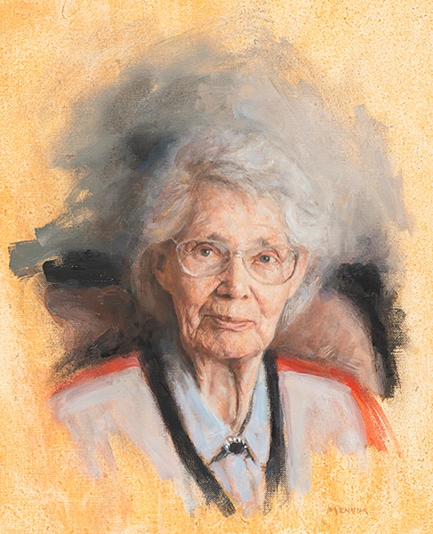

## Modeling

  

    <h3>💡 Previously on...</h3>  
    
Last week, Lhd offered the following equalities in his video on modeling complex systems

      <ul>
          <li>Modeling = Representing</li>
          <li>Complex = Inseperable</li>
          <li>Systems = Wholes</li>
      </ul> 
      
How do they encourage transdiscplinary research? How are they useful pillars to start a field? How can they be misleading? Do you remember what are the different features that came out of his examples of complex systems? How do they relate to these relationships?

  

  

    <h3>📚 Week 2 readings</h3>
    <ul class="reading-list">
      <li>📖 <a href="https://math.libretexts.org/Bookshelves/Scientific_Computing_Simulations_and_Modeling/Introduction_to_the_Modeling_and_Analysis_of_Complex_Systems_(Sayama)/02%3A_Fundamentals_of_Modeling" target="_blank">Fundamentals of Modeling  (Ch. 2 Sayama)</a>*</li>
      <li>📖 <a href="https://github.com/jstonge/2024Fall-MOCS/blob/main/docs/readings/OttoDay-2007-Ch2.pdf" target="_blank">How to construct a model (Ch. 2 Otto & Day)</a></li>
      <li>📖 <a href="https://github.com/jstonge/2024Fall-MOCS/blob/main/docs/readings/Smaldino-2023-ch1.pdf" target="_blank">Doing Violence to Reality (The rest of Ch.1 Smaldino)</a>*</li>
      <li>📄 <a href="https://www.cs.unm.edu/~joel/cs4all/WhyModel.pdf" target="_blank">Why Model? (Epstein)</a>*</li>
      <li>🔍 <a href="https://plato.stanford.edu/entries/models-science/" target="_blank">Sections 1-2 of Models in Science (SEP)</a>*</li>
      <li>🔍 <a href="https://www.jstor.org/stable/27836590" target="_blank">THE STRATEGY OF MODEL BUILDING IN POPULATION BIOLOGY (Levins 1966)</a></li>
      <li>📝 <a href="https://www2.psych.ubc.ca/~schaller/528ReadingsSmaldino2020.pdf" target="_blank">How to Translate a Verbal Theory Into a Formal Model (Smaldino)</a></li>
      <li>💡 <a href="https://hbr.org/2018/11/why-many-model-thinkers-make-better-decisions" target="_blank">Why “Many-Model Thinkers” Make Better Decisions</a></li>
    </ul>
  

Last week, we defined models as nouns. We saw that defining models forces us to make choices about what is being represented. This week, we start modeling (and philosophizing, just a little):

<iframe src="https://streaming.uvm.edu/embed/49958/" width="560" height="315" frameborder="0" allowfullscreen></iframe>

This clip is really about the different types of models. They are useful distinctions because you might want to choose one over another based on the problem at hand; engineers don't ignore the same details as mathematicians. In both cases, you are abstracting away details, but not in the same way. When you learn to categorize models, you are also building a shared vocabulary with your peers. This is the basis of effective communication with your peers.

<iframe src="https://streaming.uvm.edu/embed/49959/" width="560" height="315" frameborder="0" allowfullscreen></iframe>

Here is LHD's recipe for modeling complex systems
  
  - Whole
    - Space ${tex`\rightarrow`} discrete (network) or continuous (2D or 3D)
    - Time ${tex`\rightarrow`} discrete (rounds or generations) or continuous (clock)
    - Open or closed
  - Parts
    - What are the parts? (spatial scale)
      - People? Towns? Cells?
    - Wht distinguish the parts?
      - Sick/Healty? Dupped or not? Old healthy trees? etc
      - What do the parts know? 
        - is there memory?
    - How do they interact?

  <h3>Things to do by Thursday at noon</h3>
  <ul class="checklist">
    <li><input type="checkbox" id="task1"><label for="task1">Quiz 2 (Sections 1 and 2 of Models in Science by Frigg and Hartmann, Why Model? by Epstein, and Chapter 2 of the textbook.)</label></li>
  </ul>

---

### Part II

Following up on the recipe, here is Laurent introducing compartment models:

<iframe src="https://streaming.uvm.edu/embed/49960/" width="560" height="315" frameborder="0" allowfullscreen></iframe>

--- 

## Bonus materials

Thinking too much about models can lead to philosophical side effects, such as rejecting the idea of a grand unified theory (GUT). This side-effect is known as as epistemic pluralism, where multiple, seemingly contradictory views can coexist. 

A brand of epistemic pluralism is defended at lenght by Scott Page, in his [The Model Thinker](https://www.google.com/url?sa=t&source=web&rct=j&opi=89978449&url=https://www.basicbooks.com/titles/scott-e-page/the-model-thinker/9780465094639/&ved=2ahUKEwiOlZWq3pKIAxVGD1kFHREyFv0QFnoECEUQAQ&usg=AOvVaw3CKVi95uVUxB4dCAJL2SwO) (note that the idea is much older than Page, e.g. [Levins 1966](https://www.jstor.org/stable/27836590). But Page made the idea very sexy). He argues that multiple independent models can be more effective than a single one in addressing complex issues. However, this approach suggests that we may lack a definitive criterion for rejecting models with certainty. What implications does epistemic pluralism have for democracy, especially since we generally expect it to rely on scientific consensus?

Philip Kitcher explores this theme in [Science, Truth, and Democracy ](https://academic.oup.com/book/4724). He argues that epistemic pluralism, which leads to numerous perspectives on the world, forces us to prioritize some over others. For example, as a society, we must decide whether it's ethical to invest in projects like large hadron colliders while facing impending climate crises. How do you feel about that?

<figure class="quote">
  <blockquote>
  <h3>Famous modelers</h3>
  Why does it seem reasonable to compare billard balls moving on a table bounded by cushions with air particles jiggling around?
  Marry Hesse (1924 – 2016) pioneered the idea that modelers like to draw analogies between billard balls and gas because of similarities. Similarities can take different forms. You can have objects who look alike; but sometimes modelers find original ways to analogize, seemingly different objects. When thinking by analogy, one might realize that pitch is analogous to color, as is loudness to brightness, leading to see commonalities between sound and light. 
  

  </img>
  

  <blockquote>
</figure>

